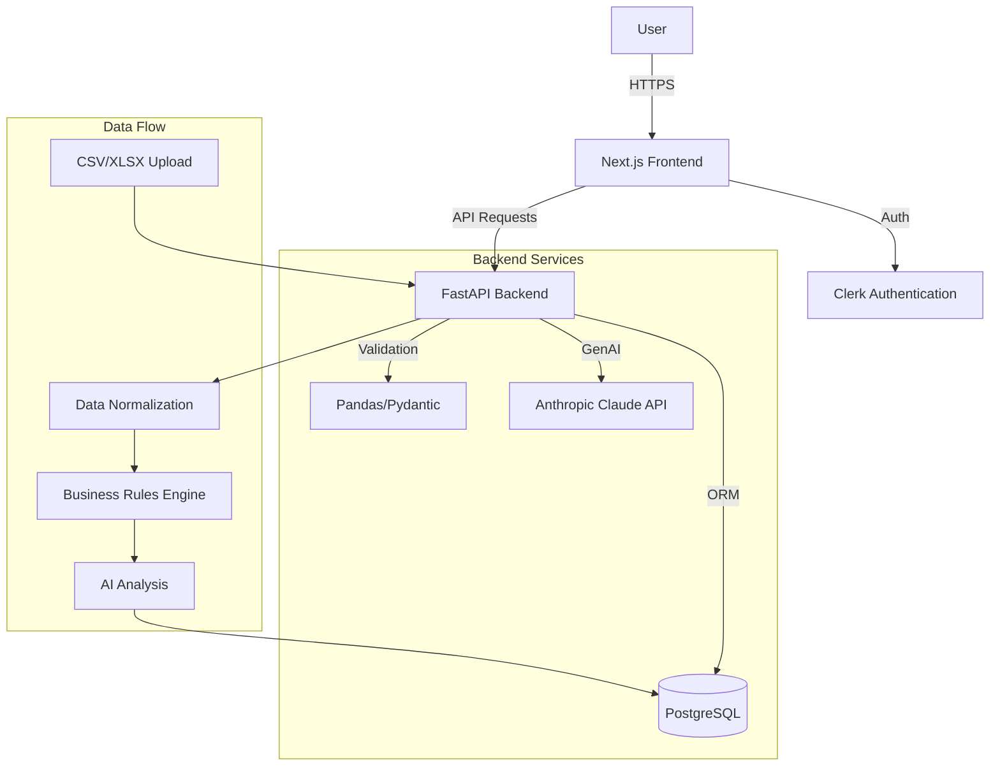

# Architecture Overview

RevTrust is a full-stack web application designed to analyze sales pipeline data using AI and statistical rules.

## System Diagram

## Core Components

### 1. Frontend (Next.js)
- **Framework**: Next.js 16 (App Router)
- **Styling**: Tailwind CSS + shadcn/ui
- **State Management**: Zustand
- **Data Fetching**: React Server Components + Client Hooks
- **Authentication**: Clerk (JWT-based)

The frontend handles file uploads, real-time progress polling, and interactive visualizations of the pipeline analysis.

### 2. Backend (FastAPI)
- **Framework**: FastAPI
- **Database Access**: Prisma Client Python
- **Data Processing**: Pandas for CSV manipulation
- **validation**: Pydantic models for strict type checking

The backend is a RESTful API that accepts file uploads, parses diverse schemas using configurable field mappings, and executes the analysis pipeline.

### 3. Business Logic
- **Field Mapping**: `backend/config/field-mappings.yaml` defines how to normalize incoming data.
- **Rules Engine**: `backend/config/business-rules.yaml` defines the hygiene checks (stale deals, probability mismatches, etc.).
- **AI Integration**: Uses Anthropic's Claude to provide qualitative feedback on deal health.

## Database Schema
The core entities in PostgreSQL are:
- `User`: Synced from Clerk.
- `Analysis`: Represents a single upload session.
- `Deal`: Individual pipeline items extracted from the file.
- `Violation`: Specific business rule failures linked to Deals.

## Security
- **Authentication**: All API endpoints are protected via Clerk JWT verify middleware.
- **CORS**: Strict allowed origins policy.
- **Environment**: Sensitive keys (DB URL, API tokens) managed via `.env`.
